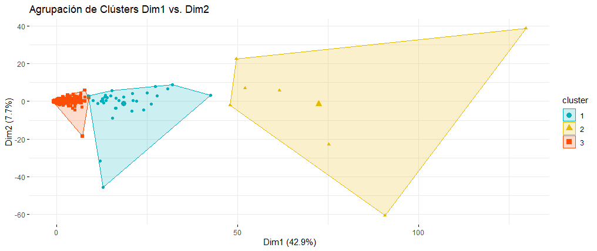
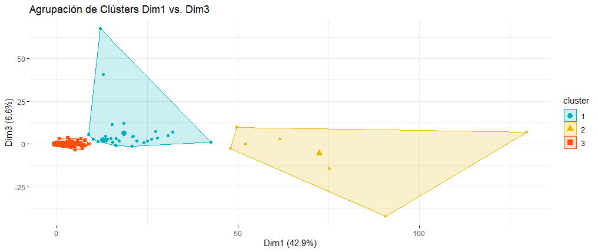
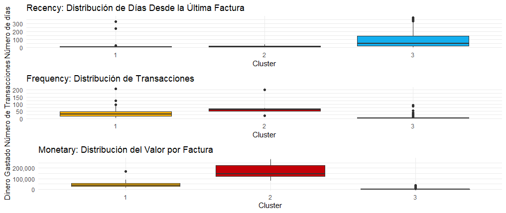
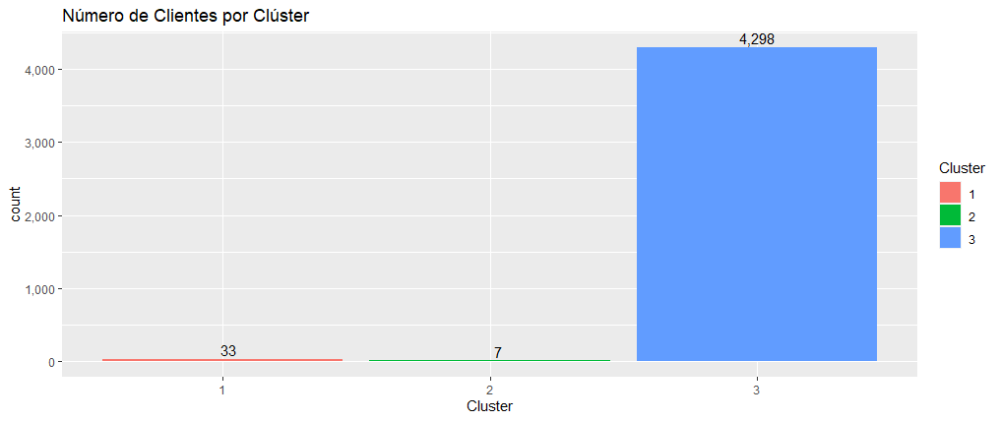
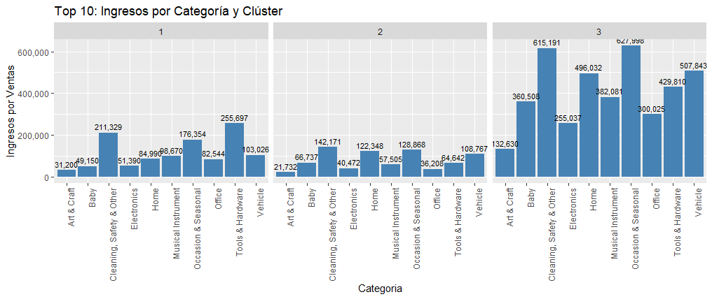
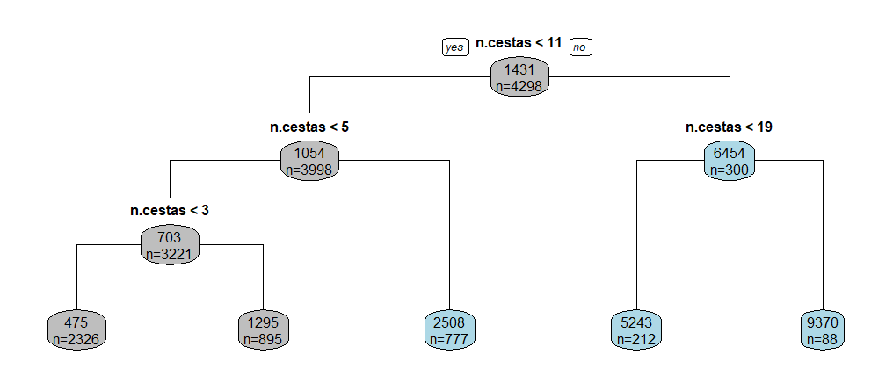

#  <span style="color:rgb(0, 0, 205)">Presentación</span>

<div class=text-justify>
En general, la técnica de segmentación consiste en crear grupos o clústers con la característica de que las observaciones dentro de cada grupo son muy similares y, por el contrario, existen diferencias marcadas entre los grupos.

La segmentación de clientes es de gran utilidad dentro de las empresas ya que permite agruparlos según las características que comparten, lo que a su vez permitirá, por ejemplo, al área de Marketing, diseñar campañas mejor focalizadas incrementando la probabilidad de éxito.

Tomando en cuenta lo anterior, la segmentación de clientes es el proceso de dividirlos en grupos basados en características comunes para que las empresas puedan comercializar y focalizar sus recursos y esfuerzos de manera efectiva y adecuada a cada segmento. Por ejemplo, al analizar el historial de compras de clientes y ventas de productos, podemos agrupar productos y clientes en grupos que se comportan de manera similar y tomar decisiones comerciales basadas en datos que pueden mejorar una amplia gama de indicadores clave de rendimiento (KPI´s) de inventario y ventas.

Desde saber qué productos comprar, cuántos de ellos y cuándo, hasta comercializar los productos correctos para los clientes correctos en el momento correcto son algunas de las ventajas de este tipo de análisis.

Los datos para este análisis provienen del repositorio de aprendizaje automático de [UC Irvine](https://archive.ics.uci.edu/ml/datasets/online+retail), que es un sitio web para la comunidad de **machine learning**, donde se pueden encontrar bases de datos para practicar data science. También, se encuentran en mi repositorio de [github](https://github.com/arojasmor/SegmentacionRetail) junto con el código de esta publicación.
</div>

#  <span style="color:rgb(0, 0, 205)">Contenido</span>

* Presentación
* Contenido
* Set up
* Carga y preparación de los datos
* Ingeniería de variables
* Análisis exploratorio
  + Ingresos por fecha
  + Ingresos por día
  + Análisis por hora del día
  + Análisis del mercado
  + Business Insights
  + Curvas de Pareto
  + Insights en la descripción de los productos
* Categorías de productos
* Segmentación de clientes
  + Prediagnóstico
  + Algoritmo K-means
  + Análisis RFM: (Recency, Frequency, Monetary)
  + Productos de interés dentro de cada Clúster
  + Resumen estadístico por Clúster
  + Segmentación adicional: árbol de decisión
* Reglas de Asociación
  + Venta cruzada
  + Algoritmo Apriori
  + Creaando reglas
* Conclusiones

#  <span style="color:rgb(0, 0, 205)">Set up</span>

Iniciamos configurando las opciones generales que vamos a requerir para el desarrollo de este proyecto.

```{r setup, message=FALSE, comment="", warning=FALSE, results='hide'}
knitr::opts_chunk$set(echo = TRUE,
                      warning = FALSE,
                      message = FALSE,
                      warning = FALSE,
                      fig.align = "center"
                      )


paquetes <- c("knitr","tidyverse","ggplot2","gridExtra","tidyverse","DataExplorer","lubridate",
              "agricolae","sf","raster","dplyr","spData","tm","tmap","cluster","factoextra",
              "FactoMineR","wordcloud","fmsb","scales","rpart","rpart.plot","kableExtra",
              "summarytools", "DT", "clustertend", "ggpubr", "sfo", "arules", "arulesViz",
              "plyr", "plotly")

instalados <- paquetes %in% installed.packages()

if(sum(instalados == FALSE) > 0) {
  install.packages(paquetes[!instalados])
}

lapply(paquetes, require, character.only = TRUE)

```
&nbsp;

#  <span style="color:rgb(0, 0, 205)">Carga y preparación de los datos</span>

<div class=text-justify>
Comencemos por cargar el conjunto de datos y hacer un primer análisis descriptivo básico para tener una idea de su tamaño y el tipo de cada variable.

El conjunto de datos a trabajar corresponden a todas las transacciones ocurridas entre el 01/12/2010 y el 09/12/2011 para un comercio minorista en línea registrado y no registrado en el Reino Unido. La empresa vende principalmente regalos únicos para todas las ocasiones. Muchos clientes de la empresa son mayoristas.
</div>

```{r}
df <- read_csv("Online Retail.csv", col_types = cols())

DT::datatable(head(df, 20),
              rownames = FALSE,
              options = list(
                pageLength = 5))

```

<div class=text-justify>
Los atributos de la base son los siguientes:

* **InvoiceNo**: Número de factura. Nominal, un número integral de 6 dígitos asignado de forma exclusiva a cada transacción. Si este código comienza con la letra 'c', indica una cancelación.
* **StockCode**: Código de producto (artículo). Nominal, un número integral de 5 dígitos asignado de forma única a cada producto distinto.
* **Description**: Nombre del producto (artículo). Nominal.
* **Quantity**: Las cantidades de cada producto (artículo) por transacción. Numérico.
* **InvoiceDate**: Fecha y hora de la factura. Numérico, el día y la hora en que se generó cada transacción.
* **UnitPrice**: Precio unitario. Numérico, Precio del producto por unidad en libras esterlinas.
* **CustomerID**: Número de cliente. Nominal, un número integral de 5 dígitos asignado de forma exclusiva a cada cliente.
* **Country**: Nombre del país. Nominal, el nombre del país donde reside cada cliente.
</div>

```{r}
str(df)
```

Tenemos entonces una base datos con 541,909 registros y 8 variables. Veamos si hay valores faltantes:

```{r}
plot_missing(df, title = "Porcentaje de Datos Incompletos",
             geom_label_args = list("size" = 3, "label.padding" = unit(0.1, "lines")),
             ggtheme = theme_minimal())

```

En la gráfica anterior, podemos apreciar que casi el 25% de los registros no tiene asignado un id de cliente, además, como esta variable representa el identificador es complicado tratar de hacer algún tipo de imputación, por lo tanto, vamos a eliminar esos registros.

```{r}
df <- na.omit(df)

plot_missing(df, title = "Porcentaje de Datos Incompletos",
             geom_label_args = list("size" = 3, "label.padding" = unit(0.1, "lines")),
             ggtheme = theme_minimal())

```

```{r}
str(df)
```

Después de eliminar los valores faltantes nos queda una base de 406,829 registros.

# <span style="color:rgb(0, 0, 205)">Ingeniería de variables</span>

Al ver el tipo de las variables podemos identificar que CustomerID es numérica y debe ser de tipo character, por lo que, hacemos el cambio:

```{r}
df$CustomerID <- as.character(df$CustomerID)
```

Las variables que podemos usar para crear variables sintéticas son:

* **InvoiceDate**: 
  + InvoiceTime: hora de facturación
  + Year: año de la facturación
  + Month: mes de la facturación
  + DayOfWeek: día de la facturación
  + HourOfDay: hora del día
* **Quantity** y **UnitPrice**: crear una variable que represente el precio total de la cesta, BasketPrice.

```{r}
df <- separate(df, col = c("InvoiceDate"),
                      into = c("InvoiceDate", "InvoiceTime"), sep = " ")

df <- separate(df, col = c("InvoiceDate"),
                      into = c("Day", "Month", "Year"), sep = "/",
                      remove = FALSE)

df <- df %>% dplyr::select(-c(Day, Month))

df$Month <- dmy(df$InvoiceDate) 
df$Month <- month(df$Month, label = TRUE)

df$InvoiceDate <- as.Date(df$InvoiceDate, "%d/%m/%Y")

df$DayOfWeek <- wday(df$InvoiceDate, label = TRUE, abbr = FALSE)
df$DayOfWeek <- as.character(df$DayOfWeek)

df <- separate(df, col = c("InvoiceTime"),
                      into = c("HourOfDay", "Minutes"), sep = ":",
                      remove = FALSE)

df <- df %>% dplyr::select(-Minutes)

df <- df %>% mutate(BasketPrice = Quantity * UnitPrice)

```

Finalmente, hay que revisar si hay registros duplicados:

```{r}
nrow(df[duplicated(df), ])

```

Tenemos 5,225 registros duplicados, por lo que, debemos eliminarlos y, además, revisar los tipos de variables para identificar si son los correctos:

```{r}
df <- dplyr::distinct(df)

str(df)

```

Las siguientes variables están como character y por conveniencia debemos pasarlas a tipo factor:

* Year
* Country
* DayOfWeek
* HourOfDay

```{r message=FALSE}
df$Year <- as.factor(df$Year)
levels(df$Year) <- c(2010, 2011)

df$Country <- as.factor(df$Country)

df$HourOfDay <- as.factor(df$HourOfDay)

df$DayOfWeek <- as.factor(df$DayOfWeek)
df$DayOfWeek <- ordered(df$DayOfWeek, 
                        levels = c("lunes", "martes", "miércoles", "jueves", "viernes", "domingo"))

kable(df[1:10, ], caption = "Dataset con nuevas variables", align = "c") %>%
  kable_styling(bootstrap_options = c("striped", "hover"), font_size = 10)

```

<div class=text-justify>
Ahora tenemos un buen marco de datos para explorar y analizar las tendencias de ventas, la rentabilidad del mercado, cancelaciones de pedidos y categorías de productos. Pero antes de pasar a la segmentación de clientes, veremos algunas de las características más importantes del conjunto de datos.
</div>

# <span style="color:rgb(0, 0, 205)">Análisis exploratorio</span>

Iniciamos confirmando que tenemos una base de datos completa, sin datos faltantes:

```{r}
df %>% 
  summarise_all(~sum(is.na(.))) %>% 
  t()
```

## <span style="color:rgb(0, 0, 205)">Ingresos por fecha</span>

A continuación, veremos la gráfica de los ingresos por ventas a lo largo del periodo de estudio, con la intención de identificar si hay alguna tendencia creciente o decreciente:

```{r}
df %>%
  group_by(InvoiceDate) %>% summarise(Revenue = sum(BasketPrice)) %>%
  ggplot(aes(x = InvoiceDate, y = Revenue)) + 
  geom_line() +
  scale_y_continuous(labels = scales::comma) +
  geom_smooth(formula = y~x, method = "loess", se = TRUE) +
  labs(x = "Fecha", y = "Ingresos", title = "Ingresos por Ventas")

```

Se puede apreciar que hay tendencia creciente aunque muy leve, sin embargo, esta primera vista no nos dice mucho, por lo que, haremos un zoom para ver qué más podemos encontrar.

## <span style="color:rgb(0, 0, 205)">Ingresos por día</span>

Ahora, veamos la gráfica de los ingresos por día, para conocer el volumen acumulado de recursos monetarios:

```{r}
df %>%
  group_by(DayOfWeek) %>% summarise(Ingresos = sum(BasketPrice)) %>%
  ggplot(aes(x = DayOfWeek, y = Ingresos)) + 
  geom_bar(stat = "identity", fill = 'steelblue') +
  geom_text(aes(label = scales::comma(round(Ingresos, 0))), 
            size = 4, 
            color = 'black',
            position = position_dodge(0.9), vjust = -0.5) +
  scale_y_continuous(labels = scales::comma) +
  labs(x = "Día de la semana", y = "Ingresos", title = "Ingresos de Ventas por Día de la Semana")

```

Se aprecia que el día de mayor ingresos es el día jueves, sin embargo, aún no sabemos el porqué, ya que podría deberse, por ejemplo, a que la facturación promedio es mayor o en ese día hay más transacciones. Para confirmar lo anterior, haremos una tabla con esos indicadores:

```{r message=FALSE}
df %>%
  group_by(InvoiceDate, DayOfWeek) %>%
  summarise(Ingresos = sum(BasketPrice), Transacciones = n_distinct(InvoiceNo)) %>%
  mutate(PromedioOrderVal = round((Ingresos/ Transacciones), 2)) %>%
  ungroup() %>% 
  head() %>% 
  kbl(align = "c", 
      digits = 2 ,
      format.args = list(big.mark = ","),
      caption = "Resumen de  Transacciones por Día de la Semana") %>%
  kable_paper("hover", full_width = T) 

```

Ya con la información que vemos en la tabla podemos darnos cuenta de que el jueves hay más ingresos porque es el día de mayor transacciones, sin embargo, el promedio por orden o factura es casi dos veces menor al promedio del martes.

```{r message=FALSE}
df %>%
  group_by(InvoiceDate, DayOfWeek) %>%
  summarise(Ingresos = sum(BasketPrice), Transacciones = n_distinct(InvoiceNo)) %>%
  mutate(PromedioOrderVal = round((Ingresos/ Transacciones), 2)) %>%
  ungroup() %>%
  ggplot(aes(x = DayOfWeek, y = Ingresos)) + 
  geom_boxplot(fill='#A4A4A4', color="darkred") + 
  scale_y_continuous(labels = scales::comma) +
  labs(x = "Día de la semana", y = "Ingresos", title = "Ingreso de Ventas por Día")

df %>%
  group_by(InvoiceDate, DayOfWeek) %>%
  summarise(Ingresos = sum(BasketPrice), Transacciones = n_distinct(InvoiceNo)) %>%
  mutate(PromedioOrderVal = round((Ingresos/ Transacciones), 2)) %>%
  ungroup() %>%
  ggplot(aes(x = DayOfWeek, y = Transacciones)) + 
  geom_boxplot(fill='#A4A4A4', color="darkred") + 
  scale_y_continuous(labels = scales::comma) +
  labs(x = "Día de la semana", y = "Transacciones", title = "Número de Transacciones por Día")

df %>%
  group_by(InvoiceDate, DayOfWeek) %>%
  summarise(Ingresos = sum(BasketPrice), Transacciones = n_distinct(InvoiceNo)) %>%
  mutate(PromedioOrderVal = round((Ingresos/ Transacciones), 2)) %>%
  ungroup() %>%
  ggplot(aes(x = DayOfWeek, y = PromedioOrderVal)) + 
  geom_boxplot(fill='#A4A4A4', color="darkred") + 
  scale_y_continuous(labels = scales::comma) +
  labs(x = "Día de la semana", 
       y = "Orden promedio",
       title = "Valor Promedio de Transacciones por Día")

```

Hasta aquí se deduce que entre los días de la semana hay diferencias sobretodo en el número de transacciones, ya que el ingreso total se ve impactado por la cantidad de ordenes facturadas.

```{r message=FALSE}
df %>%
  group_by(InvoiceDate, DayOfWeek) %>%
  summarise(Ingresos = sum(BasketPrice), Transacciones = n_distinct(InvoiceNo)) %>%
  mutate(PromedioOrderVal = round((Ingresos/ Transacciones), 2)) %>%
  ungroup() %>% 
  ggplot(aes(Transacciones, fill = DayOfWeek)) + 
  geom_density(alpha = 0.2) + labs(title = "Distribución de Transacciones por Día")
```

<div class=text-justify>
En esta gráfica de densidad se aprecia que hay tres días que sí difieren de los demás en cuanto a la simetría de las transacciones. Con apoyo de la prueba no paramétrica de Kruskal–Wallis, veremos si existen diferencias estadísticamente significativas en los datos. Recordando que la hipótesis nula es que los rangos medios de los grupos son los mismos y la hipótesis alterna es que al menos un grupo difiere:
</div>

```{r message=FALSE}
df %>%
  group_by(InvoiceDate, DayOfWeek) %>%
  summarise(Ingresos = sum(BasketPrice), Transacciones = n_distinct(InvoiceNo)) %>%
  mutate(PromedioOrderVal = round((Ingresos/ Transacciones), 2)) %>%
  ungroup() %>%
  kruskal.test(Transacciones ~ DayOfWeek)
```

El p-value de la prueba es menor al 0.05 de significancia, por lo que, se rechaza la hipótesis nula y podemos afirmar que los rangos medios son estadísticamente diferentes entre las transacciones de los días.

En resumen, el día que más ingresos se obtienen son los jueves y el domingo el que menos ingresos se captan. Los días sábados al parecer no hay operaciones.

## <span style="color:rgb(0, 0, 205)">Análisis por hora del día</span>

De manera similar al análisis por día, se puede hacer un análisis por hora para bajar aún más al detalle de la operación.

```{r}
df %>%
  group_by(HourOfDay) %>% 
  summarise(Ingresos = sum(BasketPrice)) %>%
  ggplot(aes(x = HourOfDay, y = Ingresos)) +
  geom_bar(stat = "identity", fill = 'steelblue') +
  geom_text(aes(label = scales::comma(round(Ingresos, 0))), 
            size = 2, 
            color = 'black',
            position = position_dodge(0.9), vjust = -0.3) +
  scale_y_continuous(labels = scales::comma) +
  labs(x = "Hora del Día", y = "Ingreso", title = "Ingresos por Hora del Día")

df %>%
  group_by(HourOfDay) %>% 
  summarise(Transacciones = n_distinct(InvoiceNo)) %>%
  ggplot(aes(x = HourOfDay, y = Transacciones)) +
  geom_bar(stat = "identity", fill = 'steelblue') +
  geom_text(aes(label = format(Transacciones, digits = 0, big.mark = ",")), 
            size = 4, 
            color = 'black',
            position = position_dodge(0.9), vjust = -0.3) +
  scale_y_continuous(labels = scales::comma) +
  labs(x = "Hora del Día", y = "Transacciones", title = "Transacciones por Hora del Día")

```

Al ver ambas gráficas podemos identificar que el grueso de la operación se da al medio día, presentando baja operación durante las primeras horas de la mañana y al final del día. Este comportamiento coincide con las operaciones de clientes mayoristas, ya que los consumidores comunes tienden a comprar por las tardes cuando termina su jornada de trabajo. 

## <span style="color:rgb(0, 0, 205)">Análisis del mercado</span>

En esta parte del trabajo centraremos el análisis en el mercado, ya que los datos representan ventas a varios países.

```{r message=FALSE}
mercado_mundial <- left_join(world, df, by = c("name_long" = "Country"))

world_df <- mercado_mundial %>%
  dplyr::select(iso_a2, name_long, InvoiceNo) %>% 
  na.omit(world_df) %>% 
  group_by(name_long) %>%
  summarise(Transacciones = n_distinct(InvoiceNo))

tmap_mode("view")
tm_shape(world_df) + 
  tm_polygons("Transacciones", breaks = c(0, 10, 100, 500, 1000, 20000))

```

En el mapa podemos identificar fácilmente que la mayoría de las ventas y/o pedidos se hacen desde el Reino unido (UK).

```{r}
df %>%
  group_by(Country) %>%
  summarise(Ingresos = sum(BasketPrice), Transacciones = n_distinct(InvoiceNo)) %>%
  mutate(PromedioOrderVal = round((Ingresos / Transacciones), 2)) %>% 
  arrange(desc(Ingresos)) %>%
  ungroup() %>%
  head(10) %>% 
  kbl(align = "c", 
      digits = 0 ,
      format.args = list(big.mark = ","),
      caption = "Top 10: Resumen de  Transacciones por País") %>%
  kable_paper("hover", full_width = T)

```

```{r}
df %>%
  group_by(Country) %>%
  summarise(Ingresos = sum(BasketPrice), Clientes = n_distinct(CustomerID)) %>%
  mutate(PromedioGastoCliente = round((Ingresos / Clientes), 2)) %>% 
  arrange(desc(Ingresos)) %>%
  ungroup() %>% 
  head(10) %>% 
  kbl(align = "c", 
      digits = 0 ,
      format.args = list(big.mark = ","),
      caption = "Top 10: Resumen de Clientes en Diferentes Países") %>%
  kable_paper("hover", full_width = T)

```

Ahora, solo analicemos los cinco principales países en términos de ingresos totales sin considerar UK:

```{r message=FALSE}
df %>%
  filter(Country == 'Netherlands' | 
           Country == 'EIRE' | 
           Country == 'Germany' | 
           Country == 'France' | 
           Country == 'Australia') %>% 
  group_by(Country) %>%
  summarise(Ingresos = sum(BasketPrice), 
            Transacciones = n_distinct(InvoiceNo), 
            Clientes = n_distinct(CustomerID)) %>%
  mutate(PromedioOrderVal = round((Ingresos / Transacciones), 2)) %>%
  arrange(desc(Ingresos)) %>%
  ungroup() %>% 
  kbl(align = "c", 
      digits = 0 ,
      format.args = list(big.mark = ","),
      caption = "Top 5: Resumen de Clientes en Diferentes Países") %>%
  kable_paper("hover", full_width = T)

```

En el top cinco de países (excluyendo el Reino Unido) por ingresos el que tiene menor cantidad de transacciones es Australia con 69, por el contrario, Alemania está en primer lugar en el número de transacciones pero no en ingresos.

```{r message=FALSE}
df %>%
  filter(Country == 'Netherlands' | 
           Country == 'EIRE' | 
           Country == 'Germany' | 
           Country == 'France' | 
           Country == 'Australia') %>% 
  group_by(Country) %>%
  summarise(Ingresos = sum(BasketPrice), 
            Transacciones = n_distinct(InvoiceNo), 
            Clientes = n_distinct(CustomerID)) %>%
  mutate(PromedioOrderVal = round((Ingresos / Transacciones), 2)) %>%
  arrange(desc(Transacciones)) %>%
  ungroup() %>% 
  ggplot(aes(x = reorder(Country, -Ingresos), y = Ingresos)) +
  stat_summary(fun = sum, geom = "bar", fill = "steelblue", colour = "black") +
  geom_text(aes(label = scales::comma(round(Ingresos, 0))), 
            size = 4, 
            color = 'black',
            position = position_dodge(0.9), vjust = -0.3) +
  scale_y_continuous(labels = scales::comma) +
  labs(x = "País", y = "Ingresos", title = "Ingresos por País")

```

```{r message=FALSE}
df %>%
  filter(Country == 'Netherlands' | 
           Country == 'EIRE' | 
           Country == 'Germany' | 
           Country == 'France' | 
           Country == 'Australia') %>% 
  group_by(Country, InvoiceDate) %>%
  summarise(Ingresos = sum(BasketPrice), 
            Transacciones = n_distinct(InvoiceNo), 
            Clientes = n_distinct(CustomerID)) %>%
  mutate(PromedioOrderVal = round((Ingresos / Transacciones), 2)) %>%
  arrange(InvoiceDate) %>%
  ungroup() %>% 
  ggplot(aes(x = InvoiceDate, y = Ingresos, color = Country)) +
  scale_y_continuous(labels = scales::comma) +
  geom_smooth(formula = y~x, method = "loess", se = FALSE) +
  scale_x_date(date_breaks = "1 month", date_labels = "%Y-%b") +
  theme(axis.text.x = element_text(angle = 90, size = 9)) +
  labs(x = "Fecha", y = "Ingresos", title = "Tendencia de Ingresos", subtitle = "Ventas por País")

```

En la gráfica anterior, se aprecia como los ingresos por ventas a Alemania, EIRE y Francia mantuvieron  una tendencia constante en el tiempo, mientras que Holanda y Australia presentan caídas al final del periodo.

```{r message=FALSE}
df %>%
  filter(Country == 'Netherlands' | 
           Country == 'EIRE' | 
           Country == 'Germany' | 
           Country == 'France' | 
           Country == 'Australia') %>% 
  group_by(Country, InvoiceDate) %>%
  summarise(Ingresos = sum(BasketPrice), 
            Transacciones = n_distinct(InvoiceNo), 
            Clientes = n_distinct(CustomerID)) %>%
  mutate(PromedioOrderVal = round((Ingresos / Transacciones), 2)) %>%
  arrange(desc(Transacciones)) %>%
  ungroup() %>% 
  ggplot(aes(x = Country, y = PromedioOrderVal)) +
  geom_boxplot() +
  scale_y_continuous(labels = scales::comma) +
  labs(x = "País", y = "Valor Promedio por Transacción",
       title = "Valor Promedio de la Transacción por País")

```

```{r message=FALSE}
df %>%
  filter(Country == 'Netherlands' | 
           Country == 'EIRE' | 
           Country == 'Germany' | 
           Country == 'France' | 
           Country == 'Australia') %>% 
  group_by(Country, InvoiceDate) %>%
  summarise(Ingresos = sum(BasketPrice), 
            Transacciones = n_distinct(InvoiceNo), 
            Clientes = n_distinct(CustomerID)) %>%
  mutate(PromedioOrderVal = round((Ingresos / Transacciones), 2)) %>%
  arrange(desc(Transacciones)) %>%
  ungroup() %>% 
  ggplot(aes(x = Country, y = Transacciones)) +
  geom_boxplot() +
  scale_y_continuous(labels = scales::comma) +
  labs(x = "País", y = "Transacciones",
       title = "Número de Transacciones Diarias por País")

```

En los últimos dos boxplots se puede deducir que, por ejemplo, los ingresos en EIRE parecen estar impulsados por cuatro clientes (que se representan como outliers), sin embargo, los ingresos al final del periodo están disminuyendo.

Algo similar sucede con Holanda, ya que los ingresos totales son los más altos al igual que el valor promedio por transacción, sin embargo, su tendencia es decreciente.

Francia y Alemania presentan una tendencia creciente en ingresos y, además, son los dos países que tienen mayor número de transacciones, por lo que, ahí hay una oportunidad de negocio.

## <span style="color:rgb(0, 0, 205)">Business Insights</span>

```{r}
df %>% 
  summarise(Numero.de.Productos = n_distinct(Description),
            Numero.de.Transacciones = n_distinct(InvoiceNo),
            Numero.de.Clientes = n_distinct(CustomerID)) %>% 
  kable(caption = "Estadísticas Generales", 
        align = "c", 
        format.args = list(big.mark = ",")) %>% 
  kable_styling()

```

En este resumen general se puede ver que los datos contienen 4,372 clientes que han comprado 3,885 productos diferentes. El número total de transacciones realizadas es de 22,190.

A continuación, veamos solo algunos productos comprados en cada transacción:

```{r message=FALSE}
df %>% 
  group_by(CustomerID, InvoiceNo) %>%
  summarise(NumerodeProductos = n()) %>% 
  head(10) %>% 
  kable(caption = "Cantidad de artículos comprados por transacción", 
        align = "c") %>% 
  kable_paper("hover", full_width = F)

```

<div class=text-justify>
En el cuadro anterior, se puede apreciar que aparece una factura con el prefijo "C", que significa Cancelación. También, hay presencia de clientes cuya frecuencia de compra es alta, como por ejemplo, el CustomerID 12347, que ha comprado 31 artículos en un solo pedido. Ahora, veamos quienes son los mejores clientes:
</div>

```{r message=FALSE}
df %>% group_by(CustomerID, Country) %>% 
  summarise(Cliente.Ingreso.Total = sum(BasketPrice)) %>%
  arrange(desc(Cliente.Ingreso.Total)) %>% 
  head(10) %>% 
  kable(caption = "Top 10: Contribución de Ingresos por Ventas", 
        align = "c", format.args = list(big.mark = ","), digits = 0) %>% 
  kable_paper("hover", full_width = F)

```

Como podemos ver en la tabla anterior, el CustomerID 14646 de los Países Bajos es el que más contribuye a los ingresos por ventas, seguido por CustomerID 18102 del Reino Unido.

```{r message=FALSE}
df %>%
  group_by(Country, CustomerID) %>%
  summarise(Ingresos.por.Cliente = sum(BasketPrice)) %>%
  ungroup() %>% 
  group_by(Country) %>% 
  mutate(Ingresos.por.Pais = round(sum(Ingresos.por.Cliente), 0),
         Contribucion.por.Cliente = round(Ingresos.por.Cliente / Ingresos.por.Pais, 4)) %>% 
  arrange(desc(Ingresos.por.Cliente)) %>%
  head(5) %>% 
  arrange(desc(Contribucion.por.Cliente)) %>% 
  kable(caption = "Top 5: Contribución de Clientes a los Ingresos por País", 
        align = "c", format.args = list(big.mark = ","), digits = 4) %>% 
  kable_paper("hover", full_width = T)

```

<div class=text-justify>
En esta otra tabla, podemos identificar los 5 mejores clientes por país de origen. El cliente 14646 contribuye con el 98%, aproximadamente, a los ingresos totales provenientes de Holanda y aunque los ingresos no son tan desiguales con los del cliente 18102, la diferencia en cuanto a porcentaje de contribución lo genera el ingreso total a nivel país.

Ya sabemos que hay presencia de compradores mayoristas y esto es una de las razones por las que es aún más importante segmentar cuidadosamente a los clientes para que se les pueda proporcionar la información que estarán más interesados en consumir. La segmentación permitirá, como minoristas en línea, tomar mejores decisiones de marketing y generar interacciones específicas para los clientes.
</div>

## <span style="color:rgb(0, 0, 205)">Curvas de Pareto</span>

<div class=text-justify>
A continuación, se graficarán las curvas de Pareto de los ingresos y las transacciones. Recordando que la curva de pareto consiste en mostrar la regla de que, aproximadamente, el 20% de las observaciones analizadas generan el 80% de sus resultados. Esta regla no es fija y puede variar la distribución, sin embargo, es un buen indicador que permite conocer a los mejores clientes, los más rentables.
</div>

```{r}
df %>% 
  group_by(CustomerID) %>% 
  summarise(Ventas.Netas = sum(BasketPrice)) %>%
  filter(Ventas.Netas > 0) %>% 
  arrange(desc(Ventas.Netas)) %>% 
  mutate(Ranking.Ventas = row_number(desc(Ventas.Netas)),
         Porcentaje.Acum.Ventas = cumsum(Ventas.Netas) / sum(Ventas.Netas)) %>% 
  ggplot(aes(x = Ranking.Ventas, y = Porcentaje.Acum.Ventas)) + 
  scale_x_continuous(labels = scales::comma) +
  geom_line() +
  geom_hline(yintercept = 0.80, colour = "red") +
  geom_vline(xintercept = 1175, colour = "red") +
  geom_point(aes(x = 1175, y = 0.80), color = "navyblue", size = 3) +
  ggplot2::annotate("text", 
           label = "80%-27%",
           x = 1000, y = 0.85,
           size = 3, 
           color = "navyblue") +
  labs(title = "Curva Pareto Ingresos")

```

En la curva de los ingresos se puede apreciar que con un poco mas de 1,000 clientes se logra el 80% de los ingresos, es decir, un 27% de los clientes están generando el 80% de los ingresos totales.

```{r}
df %>% 
  group_by(CustomerID) %>% 
  summarise(Ventas.Netas = sum(BasketPrice),
            Transacciones = n()) %>% 
  filter(Ventas.Netas > 0) %>% 
  arrange(desc(Transacciones)) %>% 
  mutate(Ranking.Transacciones = row_number(desc(Transacciones)),
         Porcentaje.Acum.Transacciones = cumsum(Transacciones) / sum(Transacciones)) %>% 
  ggplot(aes(x = Ranking.Transacciones, y = Porcentaje.Acum.Transacciones)) + 
  scale_x_continuous(labels = scales::comma) +
  geom_line() +
  geom_hline(yintercept = 0.80, colour = "red") +
  geom_vline(xintercept = 1452, colour = "red") +
  geom_point(aes(x = 1452, y = 0.80), color = "navyblue", size = 3) +
  ggplot2::annotate("text", 
           label = "80%-33%",
           x = 1300, y = 0.85,
           size = 3, 
           color = "navyblue") +
  labs(title = "Curva Pareto Transacciones")

```

En la curva de las transacciones la distribución cambia un poco, ya que aquí el 33% de los clientes generan el 80% de las transacciones totales.

Las curvas anteriores sirven mucho para identificar a los mejores clientes y así poder diseñar campañas de fidelización bien focalizadas y efectivas.

Echemos un vistazo al inventario para conocer cuáles son los productos más populares y rentables:

```{r message=FALSE}
productos.vendidos <- df %>% 
  group_by(Description) %>%
  summarise(Num.Vendido = n())

productos.vendidos$Description <- factor(productos.vendidos$Description , 
                            levels = productos.vendidos$Description [order(productos.vendidos$Num.Vendido)])


t1 <- productos.vendidos %>% 
  arrange(desc(Num.Vendido)) %>%
  top_n(10) %>%
  ggplot(aes(x = Description, y = Num.Vendido)) + 
  geom_bar(stat = "identity", fill = "steelblue") +
  geom_text(aes(label = format(Num.Vendido, digits = 0, big.mark = ",")), 
            size = 3, 
            color = 'black',
            position = position_dodge(0.9), hjust = 2) +
  scale_y_continuous(labels = scales::comma) +
  labs(x = "Producto", y = "Numero de Productos Vendidos", 
       title = "Top 10: Productos más Vendidos") +
  coord_flip()

productos.vendidos.por.ingresos <- df %>% 
  group_by(Description) %>%
  summarise(Ingresos = sum(BasketPrice))

productos.vendidos.por.ingresos$Description <- factor(productos.vendidos.por.ingresos$Description , 
                            levels = productos.vendidos.por.ingresos$Description
                            [order(productos.vendidos.por.ingresos$Ingresos)])

t2 <- productos.vendidos.por.ingresos %>%
  arrange(desc(Ingresos)) %>%
  top_n(10) %>%
  ggplot(aes(x = Description, y = Ingresos)) + 
  geom_bar(stat = "identity", fill = "steelblue") +
  geom_text(aes(label = scales::comma(Ingresos)), 
            size = 3, 
            color = 'black',
            position = position_dodge(0.9), hjust = 2) +
  scale_y_continuous(labels = scales::comma) +
  labs(x = "Producto", y = "Ingresos por Ventas", 
       title = "Top 10: Ingresos por Productos") +
  coord_flip()

grid.arrange(t1, t2, nrow = 2, ncol = 1)

```

## <span style="color:rgb(0, 0, 205)">Insights en la descripción de los productos</span>

<div class=text-justify>
En el conjunto de datos los productos se identifican de forma única a través de la variable StockCode y en la variable Description, viene una breve descripción. En esta parte del trabajo, se agruparán los productos según su descripción. Esta información será de gran utilidad a la hora de agrupar a los clientes y proporcionará información crucial para, por ejemplo, el área de marketing.

Se creará un corpus de las descripciones del producto y aplicando técnicas de preprocesamiento se descartarán palabras que aparezcan menos de 20 veces, además, se eliminarán palabras poco descriptivas o útiles.
</div>

```{r message=FALSE}
descripcion <- unique(df$Description)
corpus <- tm::Corpus(tm::VectorSource(descripcion)) 

# Limpieza

corpus.limpio <- tm::tm_map(corpus, function(x) iconv(x, to = 'UTF-8', sub = 'byte'))  

# Convirtiendo palabras a minusculas
corpus.limpio <- tm::tm_map(corpus.limpio, tolower)

# Removiendo stop-words
corpus.limpio <- tm::tm_map(corpus.limpio, tm::removeWords, tm::stopwords('english'))

# Eliminando terminos especificos (colores)
corpus.limpio <- tm::tm_map(corpus.limpio, tm::removeWords, 
                             c("pink", "red", "blue", "tag", "white", "black", "green", "set"))

# Quitando espacios en blanco
corpus.limpio <- tm::tm_map(corpus.limpio, tm::stripWhitespace)

```

```{r}
dtm <- tm::DocumentTermMatrix(corpus.limpio, 
                             control = list(bounds = list(global = c(20, Inf)))) 

```

```{r}
mat <- as.matrix(t(dtm))
freq_words <- sort(rowSums(mat), decreasing = TRUE)

```

Echemos un vistazo a algunas palabras clave que aparecen varias veces en las descripciones de los productos:

```{r message=FALSE}
df.keywords = as.data.frame(freq_words)
df.keywords["words"] <- rownames(df.keywords)
rownames(df.keywords) <- NULL


df.keywords$words <- factor(df.keywords$words, 
                            levels = df.keywords$words[order(df.keywords$freq_words)])


df.keywords %>% 
  arrange(desc(freq_words)) %>%
  top_n(25) %>% 
  ggplot(aes(x = words, y = freq_words)) + 
  geom_bar(stat = "identity", fill = "steelblue") +
  geom_text(aes(label = format(freq_words, digits = 0, big.mark = ",")), 
            size = 3, 
            color = 'black',
            position = position_dodge(0.9), hjust = -0.1) +
  labs(x = "Palabras Clave", 
       y = "Frecuencia ",
       title = "Palabras Clave en la Descripción de los Productos") +
  coord_flip()

```

```{r message=FALSE}
set.seed(123) # Reproducibilidad
wordcloud(df.keywords$words, df.keywords$freq_word,
          colors = brewer.pal(8, "Dark2"),
          min.freq = 2, random.order = FALSE, rot.per = 0.20,
          scale = c(5.0, 0.25))

```

En la nube de palabras se aprecia más claramente una gama de diferentes productos que se han vendido en el periodo de análisis como, por ejemplo:

* **regalos** (palabras clave: christmas, decoration, flower, cake).
* **artículos para el hogar** (palabras clave: holder, mug, glass, bowl).
* **productos de joyería** (palabras clave: necklace, bracelet, silver, earrings).

# <span style="color:rgb(0, 0, 205)">Categorías de productos</span>

<div class=text-justify>
La información que tenemos está incompleta en el sentido de que no tenemos las categorías de los productos vendidos, pues solo contamos con su descripción, por lo tanto, para obtener información más útil y procesable, será necesario conseguir dichas categorías. Esto nos ayudará a comprender mejor lo que les gusta comprar a los clientes y nos ayudará a idear mejores y más focalizadas estrategias de promoción y marketing.

Las categorías pueden proporcionarnos información muy relevante sobre qué tipo de productos suele comprar un cliente, por lo que, obtendremos los datos de una de las tiendas retail más populares a nivel mundial: **walmart**.

Los datos se obtuvieron de la [guía de categorización](https://gecrm.my.salesforce.com/sfc/p/#61000000ZKTc/a/4M0000000OSs/Wmj3VYVcRE4fLTPw7XVhddGbyXeHQqI5A4wWjJIei5A) de walmart. La información se pasó a un archivo en formato csv y con apoyo del complemento de Excel fuzzyLookup, se buscaron las coincidencias (con una tolerancia del 10%) entre la descripción de los productos de la base que estamos trabajando y la descripción del catálogo de walmart. Lo que no se pudo relacionar se etiquetó en la categoría de Others.
</div>

```{r}
# se carga el archivo
categories <- read_csv("categories.csv")

# se limpian los datos
categories$Category <- str_replace_all(categories$Category, "\n", " ")
categories$Category <- gsub("\uFFFD", "", categories$Category, fixed = TRUE)

# se muestran algunos registros
categories %>%
  head() %>% 
  kable(caption = "Descripción de Productos y Categorías de Walmart") %>%
  kable_styling(bootstrap_options = c("striped", "hover"), font_size = 15)

```

Veamos el top 10 de las categorías para conocer las preferencias de los clientes:

```{r message=FALSE}
t3 <- categories %>% 
  group_by(Category) %>%
  summarise(Cantidad = n()) %>%
  arrange(desc(Cantidad))

t3$Category <- factor(t3$Category, 
                                  levels = t3$Category
                                  [order(t3$Cantidad)])


t3 %>% 
  top_n(10) %>% 
  ggplot(aes(x = Category, y = Cantidad)) +
  geom_segment(aes(x = Category, xend = Category, y = 0, yend = Cantidad),
               color = "darkblue", lwd = 2) +
  geom_point(size = 8.5, pch = 21, bg = "steelblue", col = "red") +
  geom_text(aes(label = Cantidad), color = "white", size = 3) +
  labs(title = "Top 10: Categoría de Productos", 
       y = "Conteo de Artículos Vendidos",
       x = "Categoría de Producto") +
  coord_flip()


```

<div class=text-justify>
La gráfica anterior muestra que los productos más vendidos pertenecen a la categoría de Ocasion y Temporada, seguido por artículos de Hogar.

Con las categorías de productos ahora disponibles, tenemos un conjunto de datos que podemos utilizar para extraer el comportamiento de gasto de los clientes, sus productos de interés y cierta información básica sobre su actividad.
</div>

# <span style="color:rgb(0, 0, 205)">Segmentación de clientes</span>

<div class=text-justify>
Utilicemos el comportamiento de gasto del cliente, sus productos de interés y cierta información básica sobre su actividad para realizar la segmentación, pero antes es buena práctica identificar si los datos son aptos para agrupamiento, es decir, si las características o variables que tenemos son útiles para formar grupos bien definidos.
</div>

## <span style="color:rgb(0, 0, 205)">Prediagnóstico</span>

<div class=text-justify>
En primer lugar, se analizará la tendencia de agrupamiento de los datos utilizando estadísticas de Hopkins. El estadístico Hopkins nos ayuda a evaluar la tendencia de clustering de un conjunto de datos al calcular la probabilidad de que dichos datos procedan de una distribución uniforme, es decir, si los datos se distribuyen uniformemente no tiene sentido hacer un modelo de agrupamiento.

Pero primero debemos construir las variables para el análisis:

* Valor medio de la cesta
* Rango de valor de la cesta (mínimo, máximo)
* Frecuencia de pedido
* Tendencia a cancelar un pedido
* Actividad del usuario (primera y última compra)
* Productos de interes

Agrupemos a cada cliente para, posteriormente, determinar el número de transacciones que realizó, su compra mínima y máxima, el monto promedio gastado en todas sus transacciones, monto total gastado, días desde la primera compra, días desde la última compra y, finalmente, cuánto gasta cada cliente en cada categoría.
</div>

```{r}
ultima.fecha <- max(df$InvoiceDate)

df2 <- df %>% filter(BasketPrice > 0)

cliente.order.resum <- df2 %>% 
  group_by(CustomerID) %>% 
  summarise(n.cestas = n_distinct(InvoiceNo),
            min.cesta = min(BasketPrice),
            avg.cesta = mean(BasketPrice),
            max.cesta = max(BasketPrice),
            total.cesta = sum(BasketPrice),
            primera.compra = min(InvoiceDate),
            ultima.compra = max(InvoiceDate)) %>%
  mutate(primera.compra = as.integer(ultima.fecha - primera.compra),
         ultima.compra = as.integer(ultima.fecha - ultima.compra))

temp.df <- df2 %>%
  left_join(categories, by = c("Description" = "descripcion"))

cliente.producto.cat <- temp.df %>% 
  spread(Category, BasketPrice, fill = 0, convert = TRUE) %>%
  dplyr::select(-InvoiceNo, -StockCode, -Description, -Quantity, -InvoiceDate,
                -Month, -Year, -InvoiceTime, -HourOfDay, -UnitPrice, -Country,
                -DayOfWeek) %>%
  group_by(CustomerID) %>% 
  summarise_all(.funs = sum)

cliente.order.resum <- cliente.order.resum %>% 
  left_join(cliente.producto.cat, by = c("CustomerID" = "CustomerID"))

cliente.order.resum$CustomerID <- as.integer(cliente.order.resum$CustomerID)

kable(cliente.order.resum[1:5, c(1:8, 16:17,21, 34)], 
      format = 'html',
      table.attr = "style='width:50%;'",
      size = 5,
      align = "c",
      format.args = list(big.mark = ","),
      digits = 0,
      caption = "Resumen del Historial de Compras del Cliente") %>%
  kable_styling(font_size = 13, bootstrap_options = c("striped", "hover"))

```

<div class=text-justify>
En el cuadro anterior solo se muestran 12 variables de las 34 que contiene esta nueva base creada la cual contiene 26 categorías de productos y 8 variables calculadas. Ahora, veamos si con esta información es conveniente hacer un modelo de segmentación. Pero antes es necesario hacer un análisis de correlación para identificar si tenemos variables redundantes, ya que si las hay debemos quitarlas:
</div>

```{r}
correlacion <- round(cor(cliente.order.resum[,2:8]), 2)
correlacion

corrplot::corrplot(correlacion, method = "number", type = "upper")

```

<div class=text-justify>
En la gráfica podemos identificar que hay variables con alta correlación, como por ejemplo, la variable avg.cesta que está altamente correlacionada con las variables min.cesta y max.cesta, pues superan el 0.8. Por lo anterior, será conveniente quitar el promedio de cesta. También, las variables n.cestas y total.cesta tiene una correlación de 0.55 y, como una representa el total de facturas en cantidad y la otra en dinero, optaremos por eliminar la cantidad.
</div>

```{r}
cliente.order.resum.fin <- cliente.order.resum %>% 
  dplyr::select(-c(avg.cesta, n.cestas))

```

Volvemos hacer el análisis de correlación:

```{r}
correlacion <- round(cor(cliente.order.resum.fin[,2:6]),2)
correlacion

corrplot::corrplot(correlacion, method = "number", type = "upper")
```

Ya los datos no presentan correlaciones altas, por lo que, podemos pasar a evaluar si es conveniente hacer la segmentación.

```{r}
set.seed(123)
clustertend::hopkins(data = scale(cliente.order.resum.fin[, 2:32]), n = 50)
```

<div class=text-justify>
El estadístico de Hopkins para los datos es igual a **0.01397866**, lo que permite rechazar la hipótesis nula de que los datos se distribuyen uniformemente. Por tanto, podemos concluir que los datos están muy agrupados o que su estructura contiene algún tipo de agrupación.
</div>

## <span style="color:rgb(0, 0, 205)">Algoritmo K-means</span>

<div class=text-justify>
Para realizar la segmentación de los clientes utilizaremos el algoritmo k-means, ya que es un modelo fácil de implementar, sin emgargo, tiene la desventaja de que se requiere conocer previamente el número de grupos a crear, pero para resolver este inconveniente nos apoyaremos de algunas técnicas que ayudan a determinar la cantidad de grupos a crear.

Antes de iniciar hay que tener presente que las variables que se tienen están en diferentes unidades de medición, por ejemplo, las unidades de las fechas son completamente diferentes a las unidades en libras para las cantidades monetarias. De ahí que necesitamos escalar (homologar) los datos, para representar la verdadera distancia entre variables. Los datos se han escalado utilizando la función scale ().
</div>

```{r}
scale.cliente.order.resum <- as.data.frame(scale(cliente.order.resum.fin[,2:32]))
scale.cliente.order.resum$CustomerID <- cliente.order.resum.fin$CustomerID
scale.cliente.order.resum <- scale.cliente.order.resum %>% 
  dplyr::select(CustomerID, everything())
```

A continuación, se utilizarán dos métodos para tratar de identificar el número óptimo de clústers: wss y silhouette.

```{r }
fviz_nbclust(scale.cliente.order.resum[,2:32],
             kmeans, 
             method = "wss") # tecnica del codo

fviz_nbclust(scale.cliente.order.resum[,2:32], 
             kmeans, 
             method = "silhouette") # tecnica de la silueta

```

El método del codo parece indicarnos que deberán ser 2 o 3 grupos y la técnica de la silueta selecciona 2. Vamos a generar 3 grupos para ver cómo se agrupan los datos, ya que tenemos bastantes observaciones.

```{r}
set.seed(123)

modelo <- kmeans(scale.cliente.order.resum[,2:32], 3, nstart = 25)

scale.cliente.order.resum$Cluster <- modelo$cluster
```

<div class=text-justify>
Como la base de datos ya con el número de clúster es de 32 variables, es complicado comparar los grupos asignados en todas las variables (las visualizaciones legibles están restringidas a un máximo de 3 dimensiones). Por lo anterior, utilizaremos el **Análisis de Componentes Principales (PCA)**, ya que esta técnica crea combinaciones lineales de las variables originales y éstas nuevas variables llamadas componentes PCA, capturan la mayor parte de la variación de los datos. Al trazar la distribución de los conglomerados en los primeros componentes de la PCA debería permitirnos ver si los conglomerados están separados o no.
</div>

```{r}
pca <- PCA(scale.cliente.order.resum[,2:33],  graph = FALSE)

fviz_screeplot(pca, addlabels = TRUE, ylim = c(0, 50))

```

Para este caso, tracemos la forma en que se distribuyeron los grupos comparando el 1 y el 2, así como el 1 y el 3 componentes de PCA.

```{r}
pca1 <- fviz_cluster(modelo, data = scale.cliente.order.resum[,2:33],
             axes = c(1,2),
             geom = "point",
             palette = c("#00AFBB", "#E7B800", "#FC4E07"),
             ggtheme = theme_minimal(),
             main = "Agrupación de Clústers Dim1 vs. Dim2")

```

{width=100%}

```{r}
pca2 <- fviz_cluster(modelo, data = scale.cliente.order.resum[,2:33],
             axes = c(1,3),
             geom = "point",
             palette = c("#00AFBB", "#E7B800", "#FC4E07"),
             ggtheme = theme_minimal(),
             main = "Agrupación de Clústers Dim1 vs. Dim3")

```

{width=100%}

De los gráficos anteriores podemos concluir que el número de grupos elegido (tres) están bien separados y no hay superposición alguna.

Ya habiendo formado los grupos de clientes, lo que sigue es caracterizarlos, en otras palabras, debemos hacer resúmenes descriptivos con las variables que tenemos.

## <span style="color:rgb(0, 0, 205)">Análisis RFM: (Recency, Frequency, Monetary)</span>

El **RFM** es una herramienta de análisis de marketing que se utiliza para identificar a los mejores clientes de una empresa o de una organización mediante el uso de determinadas medidas. El modelo RFM se basa en tres factores cuantitativos:

* Recency: qué tan recientemente un cliente ha realizado una compra.
* Frequency: la frecuencia con la que un cliente realiza una compra.
* Monetary: cuánto dinero gasta un cliente en compras.

<span style="color:rgb(204, 153, 0)">Recency</span>

Recency se calculó con la fecha de la última compra del cliente menos la fecha de la última transacción, en días.

Veamos algunas gráficas de cada variable, pero sin considerar los grupos creados para conocer las distribuciones de las mismas y, posteriormente, mostrar resumenes por clúster.

```{r }
Actualidad <- df %>% 
  group_by(CustomerID) %>%
  summarise(Ultima.Actividad.Cliente = max(InvoiceDate)) %>%
  mutate(Ultima.Factura = max(Ultima.Actividad.Cliente))

Actualidad$Recency <- round(as.numeric(difftime(Actualidad$Ultima.Factura, Actualidad$Ultima.Actividad.Cliente , units = c("days"))))

Actualidad <- Actualidad %>%
  dplyr::select(CustomerID, Recency)

summary(Actualidad$Recency)

```

El resumen anterior nos indica lo siguiente:

* El 50% de los clientes tienen menos de 50 días de inactividad.
* El promedio sin realizar alguna compra es de 3 meses.
* Existen clientes que no han realizado una sola campra en más de un año.

```{r message=FALSE}
Actualidad %>% 
  ggplot(aes(Recency)) +
  geom_histogram() +
  geom_vline(xintercept = 100, colour = "red") +
  labs(title = "Distribución de Inactividad", y = "Número de Clientes")

```

En la gráfica anterior, se aprecia que la mayoría de los clientes han estado inactivos en los últimos 100 días. Recordar que la antigüedad o inactividad es la diferencia entre la fecha de la última compra del cliente y la fecha de la última transacción, en días.

<span style="color:rgb(204, 153, 0)">Frequency</span>

La frecuencia se calculó contando la cantidad de veces que un cliente ha realizado una transacción.

```{r}
Frecuencia <- df %>% 
  group_by(CustomerID) %>%
  summarise(Frecuencia = n())

summary(Frecuencia$Frecuencia)

```

Algunas de las conclusiones que se pueden sacar al ver el resumen anterior son:

* El promedio de compras por año es de 90, aproximadamente.
* Prácticamente, el 75% de clientes (3er. cuartil) tiene menos de 100 compras en el año.
* Hay una gran diferencia en la cantidad de transacciones que realizó el último cliente o clientes y el 75% restante. 

Lo anterior, indica que hay datos atípicos y para investigarlo más a fondo hagamos dos análisis: uno hasta el 75% de los clientes y el segundo para el resto, ya que es en éste rango donde están las frecuencias de compra más elevadas.

```{r}
Frecuencia %>% 
  as.data.frame() %>%  
  arrange(desc(Frecuencia)) %>% 
  head(25) %>% 
  kable(align = "c", 
        caption = "Top 25: Frecuencia de Compras",
        format.args = list(big.mark = ","), 
        digits = 0) %>%
  kable_paper("hover", full_width = F)

```

<div class=text-justify>
En la tabla anterior, se observan las 25 frecuencias más altas y podemos identificar que fue 1 cliente el que realizó 7,812 transacciones, por lo que, muy probablemente sea un mayorista. veamos los boxplots:
</div>

```{r}
Frecuencia_3Q <- Frecuencia %>%
  filter(Frecuencia <= 99)

Atipicos <- Frecuencia %>%
  filter(Frecuencia >= 100)

```

```{r}
Frecuencia_3Q %>% 
  ggplot(aes(x = factor(1), y = Frecuencia)) +
  geom_boxplot() +
  labs(title = "Frecuencia de Compras Cuartil 3", 
       y = "Número de Compras por Cliente",
       x = "CustomerID")

```

```{r}
Atipicos %>% 
  ggplot(aes(x = factor(1), y = Frecuencia)) +
  scale_y_continuous(labels= scales::comma) +
  geom_boxplot(outlier.color = "red", alpha = 0.1, outlier.size = 4) +
  labs(title = "Frecuencia Compras Atípicas", 
       y = "Número de Compras por Cliente",
       x = "CustomerID")

```

Con estos boxplots podemos confirmar que hay clientes que compran poco pero lo hacen frecuentemente y, también, que hay clientes que compran en grandes cantidades pero lo hacen en pocas ocasiones.

<span style="color:rgb(204, 153, 0)">Monetary</span>

Esto se refiere a la suma total de ingresos generados por el cliente en el transcurso de un año.

```{r}
# Monetary Value: group CustomerID y IngresoTotal
Monetary <- df %>% 
  group_by(CustomerID) %>% 
  summarise(Monetary = sum(BasketPrice))

summary(Monetary$Monetary)

```

En el resumen estadístico anterior, se observa que hay ingresos negativos, lo que sugiere que pueden ser las cancelaciones. Además, también se observa que hay datos atípicos muy grandes, por lo que, haremos lo mismo que para la Frecuencia de compra.

```{r}
Monetary %>% 
  as.data.frame() %>%  
  arrange(desc(Monetary)) %>% 
  head(25) %>% 
  kable(align = "c", 
        caption = "Top 25: Ingreso Total por Cliente",
        format.args = list(big.mark = ","), 
        digits = 0) %>%
  kable_paper("hover", full_width = F)

Monetary_3Q <- Monetary %>%
  filter(Monetary <= 1600)

Monetary_Outliers <- Monetary %>%
  filter(Monetary > 1600)

```

Vemos en el cuadro anterior que hay una gran desigualdad en cuanto a los ingresos que dejan algunos clientes, ya que considerando el top 25, el ingreso menor es de 31,300 y el ingreso máximo es de 279,489.

```{r message=FALSE}
Monetary_3Q %>%
  filter(Monetary > 0) %>% 
  ggplot(aes(Monetary)) +
  geom_histogram() +
  scale_x_continuous(labels = scales::comma) +
  scale_y_continuous(labels = scales::comma) +
  labs(title = "Ingreso Clientes Cuartil 3", 
       y = "Número de Clientes",
       x = "Ingreso")

```

```{r message=FALSE}
Monetary_Outliers %>%
  filter(Monetary < 250000) %>% 
  ggplot(aes(Monetary)) +
  geom_histogram() +
  scale_x_continuous(labels = scales::comma) +
  scale_y_continuous(labels = scales::comma) +
  labs(title = "Ingreso Atípico", 
       y = "Número de Clientes",
       x = "Ingreso")

```

En los gráficos anteriores se quitaron los ingresos negativos y los dos ingresos más altos para eliminar la distorsión en las visualizaciones. Al igual que con las frecuencias de compra los ingresos también presentan grandes desigualdades. Esta información es de utilidad para caracterizar a los clústers.

A continuación, se muestra una tabla resumen que explica las diferencias en los tres grupos. 

```{r results='hide'}
cliente.order.resum$Cluster <- as.factor(scale.cliente.order.resum$Cluster)

cliente.order.resum %>% 
  group_by(Cluster) %>%
  summarise('Número.de.Clientes' = n(),
            'Promedio.Ultima.Compra' = round(mean(ultima.compra)),
            'Frecuencia.Promedio.Compra' = round(mean(n.cestas)),
            'Gasto.Promedio' = round(mean(total.cesta)),
            'Ingreso.Total.Cluster' = sum(total.cesta)) %>% 
  kable(align = "c", 
        caption = "Resumen por Tipo de Clúster",
        format.args = list(big.mark = ","), 
        digits = 0) %>%
  kable_paper("hover", full_width = T)

```


<div class=text-justify>
En general, es necesario analizar distribuciones para cada variable agrupada por el clúster asignado. Vamos a utilizar diagramas de caja (boxplots) para analizar las distribuciones de las variables relevantes. A continuación, presentamos diagramas de caja para analizar la distribución de días desde la última compra, distribución de las transacciones o periodicidad de las compras  y la distribución del dinero gastado en cada uno de los tres grupos.
</div>

```{r results='hide'}
r <- cliente.order.resum %>%
  ggplot(aes(x = Cluster, y = ultima.compra, fill = Cluster)) +
  geom_boxplot(fill = c("#FFB400", "#C20008", "#13AFEF")) +
  labs(x = "Cluster", y = "Número de días",
       title = "Recency: Distribución de Días Desde la Última Factura") +
  scale_fill_brewer(palette = "RdBu") +
  theme_minimal()

f <- cliente.order.resum %>%
  ggplot(aes(x = Cluster, y = n.cestas, fill = Cluster)) +
  geom_boxplot(fill = c("#FFB400", "#C20008", "#13AFEF")) +
  labs(x = "Cluster", y = "Número de Transacciones",
       title = "Frequency: Distribución de Transacciones") +
  scale_fill_brewer(palette = "RdBu") +
  theme_minimal()

m <- cliente.order.resum %>%
  ggplot(aes(x = Cluster, y = total.cesta, fill = Cluster)) +
  geom_boxplot(fill = c("#FFB400", "#C20008", "#13AFEF")) +
  scale_y_continuous(labels = scales::comma) +
  labs(x = "Cluster", y = "Dinero Gastado",
       title = "Monetary: Distribución del Valor por Factura") +
  scale_fill_brewer(palette = "RdBu") +
  theme_minimal()


```

{width=100%}

A partir del análisis visual y de la tabla resumen anterior, se pueden detectar algunas características simples sobre los clientes en cada grupo.

```{r results='hide', eval=FALSE}
cliente.order.resum %>% 
  ggplot(aes(Cluster, fill = Cluster)) +
  scale_y_continuous(labels = scales::comma) +
  geom_bar() +
  geom_text(stat = 'count', 
            aes(label = format(stat(count), digits = 0, big.mark = ",")), 
            vjust = -0.3, 
            size = 4
            ) +
  labs(title = "Número de Clientes por Clúster")

```

{width=100%}

**Grupo 1 formado por 33 clientes:**

* Gastan por cada factura en promedio 46,577.
* Hacen pedidos al mayoreo.
* Se tardan, en promedio, 22 días para volver a comprar.
* Son clientes habituales mayoristas.

**Grupo 2 formado por 7 clientes:**

* Tienden a gastar una gran cantidad de dinero en cada factura, 171,563, en promedio.
* Hacen, en promedio, el mayor número de pedidos (mayoreo).
* Son los clientes de alto valor.

**Grupo 3 formado por 4,298 clientes:**

* Tienden a gastar una cantidad de moderada a baja por factura, 1,431, en promedio.
* El número de transacciones es extremadamente bajo, 4 pedidos en promedio.
* Estos clientes son menos activos, ya que tardan, en promedio, 3 meses antes de realizar su última compra.
* Podemos clasificar al grupo como típicos cazadores de gangas (No Mayoristas). 

## <span style="color:rgb(0, 0, 205)">Productos de interés dentro de cada Cluster</span>

A continuación, analicemos la tendencia de cada uno de los tres grupos, para comparar un producto en una categoría específica.

```{r message=FALSE}
product.cluster <- cliente.order.resum %>%
  dplyr::select(-CustomerID, -n.cestas, -min.cesta, -avg.cesta, 
                -max.cesta, -total.cesta, -primera.compra, -ultima.compra)

product.cluster <- product.cluster %>%
  gather(key = "Categoria", value = "BasketValue", -Cluster)

#g4
g4 <- product.cluster %>% 
  filter(Categoria %in% c("Occasion & Seasonal", "Home", 
                                "Vehicle", "Tools & Hardware",
                                "Cleaning, Safety & Other", "Musical Instrument", "Office",
                                "Art & Craft", "Baby" , "Electronics")) %>%
  dplyr::group_by(Cluster, Categoria) %>% 
  summarise(BasketValue = sum(BasketValue)) %>% 
  ggplot(aes(x = Categoria, BasketValue)) +
  geom_bar(stat = "identity", fill = "steelblue") +
  geom_text(aes(label = scales::comma(round(BasketValue, 0))), 
            size = 3, 
            color = 'black',
            position = position_dodge(0.9), vjust = -0.5) +
   scale_y_continuous(labels = scales::comma) +
  labs(x = "Categoria", y = "Ingresos por Ventas",
       title = "Top 10: Ingresos por Categoría y Clúster") +
  theme(axis.text.x = element_text(angle = 90, hjust = 1)) +
  facet_wrap(~Cluster)

```

{width=100%}

En los gráficos anteriores se muestran los ingresos por categoría de producto de acuerdo con su correspondiente grupo. Podemos resumir la tendencia a comprar en una categoría específica.

**Grupo 1:**

* Gastan más en Tools & Hardware seguido de Cleaning, Safety & Other. Por el contrario, gastan menos en Art & Craft y en artículos Baby.

**Grupo 2:**

* Estos clientes gastan más en Cleaning, Safety & Other y en Occasion & Seasonal. Las categorías en donde gastan menos son Art & Craft y Office.

**Grupo 3:**

* El grupo más numeroso gasta más en Occasion & Seasonal y Cleaning, Safety & Other. Al igual que en los otros dos grupos, la categoría donde menos gastan es en Art & Craft seguida por Electronics.

```{r}
sk <- product.cluster %>% 
  dplyr::group_by(Cluster, Categoria) %>% 
  summarise(venta.Total = sum(BasketValue))

sk$Cluster <- as.character(sk$Cluster)

# En la gráfica se mueven los grupos a la hora de generar el archivo html: el grupo 1 es el 3, el grupo 2 es el 1  y el grupo 3 es el 2.
sankey_ly(x = sk, 
          cat_cols = c("Cluster", "Categoria"), 
          num_col = "venta.Total", 
          title = "Distribución de Ingresos por Clúster Según Productos Comprados") 
```


## <span style="color:rgb(0, 0, 205)">Resumen Estadístico por Clúster</span>

Veamos algunas estadísticas por grupo:

```{r}
resumen <- psych::describeBy(cliente.order.resum[,2:34], cliente.order.resum[,'Cluster'])

```

```{r }
kable(resumen[[1]], 
      format = "html",
      digits = 2, 
      size = 5,
      caption = "Resumen Clúster 3",
      format.args = list(big.mark = ","),
      table.attr = "style='width:50%;'") %>%
  kable_styling(bootstrap_options = c("striped", "hover"))

```


```{r }
kable(resumen[[2]], 
      format = "html",
      digits = 2,
      size = 5,
      caption = "Resumen Clúster 1",
      format.args = list(big.mark = ","),
      table.attr = "style='width:50%;'") %>%
  kable_styling(bootstrap_options = c("striped", "hover"))
```


```{r }
kable(resumen[[3]], 
      format = "html",
      digits = 2,
      size = 5,
      caption = "Resumen Clúster 2",
      format.args = list(big.mark = ","),
      table.attr = "style='width:50%;'") %>%
  kable_styling(bootstrap_options = c("striped", "hover"))
```

## <span style="color:rgb(0, 0, 205)">Segmentación adicional: árbol de decisión</span>

Se puede bajar el análisis aún más para poder descubir más patrones de consumo de los clientes en cada grupo, por lo que, a continuación, se hará una segmentación más detallada con apoyo de un árbol de decisión solo al grupo 3, ya que es donde se encuentra el grueso de los clientes.

Se seleccionó el Valor Monetario como valor para la segmentación adicional, utilizando la frecuencia y la actualidad como estimadores de la misma.

```{r results='hide', eval=FALSE}
arbol.cluster.3 <- cliente.order.resum %>%
  filter(Cluster == '3') %>%
  dplyr::select(n.cestas, total.cesta, ultima.compra)

fit.arbol <- rpart(total.cesta ~ ., 
                 data = arbol.cluster.3,
                 method = 'anova', 
                 control = rpart.control(cp = 0.0127102))

fig <- rpart.plot(fit.arbol, type = 1, extra = 1, box.palette = c("gray", "lightblue"))

```

{width=100%}

<div class=text-justify>
Esta subsegmentación del Clúster 3 dividió el clúster en 5 clústeres diferentes más pequeños.

Veamos los resultados de clientes de bajo valor a clientes de alto valor (de derecha a izquierda en el árbol):

* 2,326 clientes presentan menos de 3 cestas de compras con un valor monetario promedio de 475.
* 895 clientes que compran más de 3 veces pero menos de 5 veces, valor monetario promedio de  1,295 (significativamente más alto que el grupo anterior).
* 777 clientes compran entre 6 y 10 cestas con un valos promedio de 2,508.
* Son 212 clientes que compran más de 11 pero menos de 19 cestas con un valor monetario promedio de 5,243.
* Los restantes 88 clientes de este grupo 3 compran más de 19 cestas con un valor promedio de 9,370.

Este último subsegmento de 88 clientes son los consumidores más valiosos dentro del clúster 3. Con este hallazgo se pueden empezar a implementar estrategias y/o campañas más focalizadas ya sea para fidelizar a este subsegmento o para incrementar el valor monetario promedio de los subsegmentos más bajos dentro de este clúster.
</div>

# <span style="color:rgb(0, 0, 205)">Reglas de Asociación</span>

## <span style="color:rgb(0, 0, 205)">Venta cruzada</span>

<div class=text-justify>
Ya para terminar aprovecharemos la información sobre la descripción de los productos para hacer otro análisis que también tiene que ver con la identificación de patrones de consumo: **reglas de asociación.** Utilizaremos el algoritmo **Apriori**.

La venta cruzada es la capacidad de vender más productos a un cliente mediante el análisis de las tendencias de compra de los clientes, así como las tendencias y patrones generales de compra que son comunes con los patrones de compra del cliente.

Por lo tanto, vamos a investigar las transacciones del cliente para descubrir posibles  recomendaciones a las necesidades originales del cliente con el objetivo de ofrecerlas como una sugerencia con la esperanza y la intención de que las compren beneficiando tanto al cliente como al establecimiento.

Todo el concepto de minería de reglas de asociación se basa en el concepto de que el comportamiento de compra del cliente tiene un patrón que puede explotarse para vender más artículos al cliente en el futuro.

La técnica de reglas de asociación es un método de **machine learning** basado en reglas para descubrir relaciones interesantes entre variables en grandes bases de datos. Su objetivo es identificar reglas sólidas descubiertas en bases de datos utilizando algunas medidas de interés.

* Soporte: se define como la cantidad de veces que un conjunto de elementos (itemset) aparece en el conjunto de datos.
* Confianza: la confianza es una indicación de la frecuencia con la que se ha descubierto que la regla es cierta. Es una medida del número de veces que se encuentra que existe una regla en el conjunto de datos.
* Lift: la elevación de la regla se define como la relación entre el soporte observado y el soporte esperado en el caso de que los elementos de la regla fueran independientes.
</div>

## <span style="color:rgb(0, 0, 205)">Algoritmo Apriori</span>

Nuevamente, nos enfocaremos solo en el clúster 3, ya que es donde se encuentra el mayor número de clientes, sin embargo, bien se podría analizar toda la base de datos sin ningún ptoblema.

```{r}
# Esto se hace una sola vez, por tanto solo se comenta:
#cliente.order.resum$CustomerID <- as.character(cliente.order.resum$CustomerID)

# df3 <- cliente.order.resum %>% 
#   filter(Cluster == '3') %>% 
#   select(CustomerID, Cluster) %>% 
#   inner_join(df, by = "CustomerID") %>% 
#   select(CustomerID, InvoiceNo, Description, InvoiceDate, BasketPrice, Quantity, UnitPrice)


# reglas <- df3 %>% 
# mutate(Description = as.factor(Description)) %>% 
#    dplyr::select(InvoiceNo, Description, InvoiceDate)
# 
# transacciones <- ddply(reglas, c("InvoiceNo", "InvoiceDate"),
#                         function(df1)paste(df1$Description,
#                                            collapse = ","))
# transacciones$InvoiceNo <- NULL
# transacciones$InvoiceDate <- NULL

# colnames(transacciones) <- c("Productos")

# write.csv(transacciones,"transacciones.c3.csv", quote = FALSE, row.names = FALSE)

tr <- read.transactions("transacciones.c3.csv", format = 'basket', sep = ',')

summary(tr)

reglas.asociacion <- apriori(tr, parameter = list(supp = 0.01, conf = 0.8, maxlen = 5))

summary(reglas.asociacion)

inspect(reglas.asociacion)

```

con los argumentos seleccionados, se crearon 12 reglas de asociación con los datos del clúster 3.

Evaluación:

Vamos a calcular el test exacto de Fisher (test de significancia para obtener si las reglas representan patrones reales).

```{r}
testFisher <- interestMeasure(reglas.asociacion,
                measure = "fishersExactTest",
                transactions = tr)

summary(testFisher)

```

Todos los p-valores del test son pequeños (menores a 0), lo que refleja que es muy probable que las reglas reflejen patrones de comportamiento en los pedidos.

Visualización:

<div class=text-justify>
En la gráfica siguiente se representan redes asociadas a las reglas encontradas, pulsando sobre el circulo perteneciente a cada regla se pueden obtener sus parámetros  **support, confidence, lift y count**.
</div>

```{r}
plot(reglas.asociacion, method = "graph",  engine = "htmlwidget")

```

## <span style="color:rgb(0, 0, 205)">Creando reglas</span>

```{r}
inspectDT(reglas.asociacion)
```

En la tabla anterior, se pueden observar las principales **Reglas de Asociación de productos** encontradas y se leen de la siguiente manera:

1. **LHS**: Producto (o combinación de productos vendidos).
2. **RHS**: Producto que probablemente se venda a partir de LHS.
3. **support**: El soporte nos dice qué tan frecuente es un elemento o un conjunto de elementos en todos los datos, es decir, nos dice qué tan popular o frecuente es un conjunto de elementos en el conjunto de datos analizado.
4. **confidence**: La confianza nos dice qué probabilidad hay de que alguien compre el producto en la columna **RHS** cuando ya ha comprado el de la columna **LHS**.
5. **lift**: El Levantamiento nos dice qué tan probable es RHS cuando LHS ya ha ocurrido, teniendo en cuenta el soporte de ambos; si este es < 1 *es poco probable*; si es 1 *no es probable*; si es  > 1 *es muy probable*.
6. **count**: Cantidad de veces que ha ocurrido esa venta.

# <span style="color:rgb(0, 0, 205)">Conclusiones</span>

<div class=text-justify>

Con este análisis de segmentación pudimos incorporar más técnicas de análisis que nos ayudaron a encontrar más patrones de consumo de los clientes como lo fueron un árbol de decisión y las reglas de asociación. Lo anterior, es una muestra de que es posible afinar y detallar cada vez más los análisis combinando diferentes algoritmos.

En cuanto a los clientes habituales del Clúster 1, es posible que se les anime a regresar dentro del mismo mes de su última compra si se les informa sobre productos nuevos y/o exclusivos. Además, sería altamente recomendable enviarles publicidad para darles a conocer sobre descuentos en Tools & Hadware y Cleaning, Safety & Other o sobre nuevos productos en éstas categorías.

Para el Clúster 2, todos los clientes de alto valor pueden ser empresarios, por lo que solicitan cantidades de productos al por mayor. Podemos prepararles una oferta para que obtengan un descuento adicional cuando compren al por mayor. Además, diseñar programas de postventa.

Son 88 clientes los de mayor valor dentro del clúster 3, por lo que, podemos considerarlos dentro de las mismas estrategias del clúster 2. Para otros clientes del Clúster 3, podemos ofrecer promociones seleccionadas para productos de sus categorías de interés y enviar periódicamente las ofertas de descuento por correo electrónico o mostrar el mensaje justo después de que el usuario inicie sesión en el sitio web.

Con respecto a las reglas encontradas pudimos identificar que la mayoría de las transacciones tienen que ver con productos similares de cocina como café, té, azúcar y tazas. Esto suena lógico, ya que son alimentos que suelen comprarse en un mismo ticket. 

Tal vez sería adecuado complementar este análisis con la creación de un sistema de recomendación, sin embargo, queda fuera del alcance del presente trabajo.
</div>


